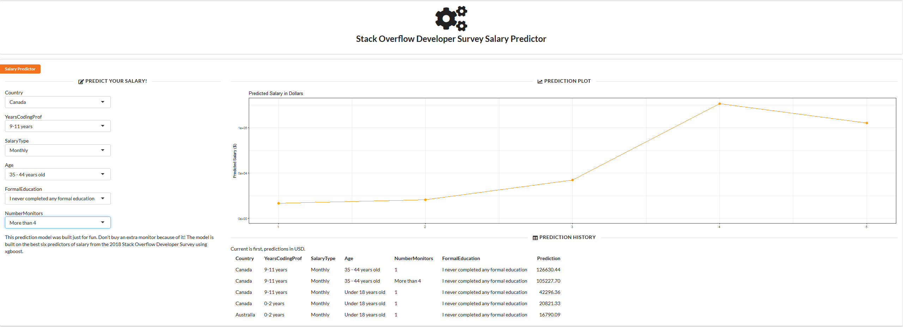

## Introduction

With the recent release of the [Stack Overflow Developer Survey Results](https://insights.stackoverflow.com/survey/2018/) and it being [Shiny Appreciation Month](https://twitter.com/hashtag/ShinyAppreciation), a couple of us at Mango thought it would be fun to each make a Shiny app based on the same data and see what we came up with.

## The data and idea

The dataset is really rich, with over 100,000 developers responding, covering areas like

  * Demographics
  * Job Roles
  * Technology
  * Tools
  * Job Priorities

There are over 100 variables in the dataset, but time is short and one variable caught my eye: **Salary**. I thought it would be fun to build a quick predictive model trying to use just a few of the most important variables to predict salary, then present the model in a shiny app using the new **shiny.semantic** package as I've been wanting an excuse to check it out.


## Data preparation

I kept the data preparation to a minimum, filtering to just full-time developers who had completed the Salary question.


### Reformatting multiple response questions
The main data prep issue was questions with multiple responses, e.g. under `DevType` respondents might say "Back-end developer;Front-end developer;Full-stack developer" all under one variable. I wanted to create a variable per Developer Type. Thankfully like most things, somebody has already solved it -- the [stacksurveyr](https://github.com/dgrtwo/stacksurveyr) package based on the 2016 survey has a handy `stack_multi` function which I adjusted for my needs. The key part is using `unnest` with `str_split` to split out each multiple choice answer: 


```r
x <- read_csv("data/developer_survey_2018/survey_results_public.csv")
stack_multi <- function(data, columns) {
  data %>%
    dplyr::select(Respondent, one_of(columns)) %>%
    tidyr::gather(column, answer, -Respondent) %>%
    dplyr::filter(!is.na(answer)) %>%
    tidyr::unnest(answer = stringr::str_split(answer, ";"))
}
# After figuring out the multi_var columns:
expanded_multi <- stack_multi(x, multi_vars)
```

### Dealing with variables with many categories

Some variables contained categories with very few responses so I used the excellent `forcats::fct_lump` to lump the rarer categories into one "Other" category.


```r
x <- x %>% mutate_at(.vars = vars(Country, CurrencySymbol, VersionControl),
          fct_lump, prop = 0.01)
```

I also imputed a few missing values, and took the `log` of Salary to make modelling easier (Salary commonly has extreme outliers, and this dataset was no exception).


## Feature Selection

I wanted just a few of the best variables to use as predictors in my model, then I could make a shiny app with just a few input fields for users to predict an average salary for similar developers, or just see how much the variables affect salary.

As speed was of the essence (to play with shiny.semantic ASAP!) I took an automated approach to find some good candidate variables for my model.

The **caret** package provides a *recursive feature elimination* function, starting with a model with all the predictors and then the least important variables are removed. I wasn't sure how many variables I needed to retain for a good model but caret lets you try different subsets and measures the results:


```r
subsets <- c(3, 5, 7, 9)
ctrl <- rfeControl(functions = treebagFuncs,
                   method = "repeatedcv",
                   number = 5,
                   repeats = 5,
                   verbose = FALSE)

rfProfile <- rfe(x = select(x, -LogSalary), y = x$LogSalary,
                 sizes = subsets,
                 rfeControl = ctrl)
```


### Selected Features

The results showed I could make a fairly decent model with only six variables. Some of the selected variables were pretty obvious:

  * Level of formal education
  * Years experience of professional coding
  * Age
  * Country
  
A couple that were more interesting were:

  * Salary Type (Yearly, Monthly, Weekly)
  * Number of monitors
  
Number of monitors? Maybe I should consider investing in an extra one! Now is probably a good time to trot out the standard line: **Correlation does not equal causation!**
  
### Final Model

After again using the **caret** package to try out a few different model types I found XGBoost produced the most accurate model.


```r
ctrl <- trainControl(method = "cv", number = 5)
xgbLinear1 <- train(LogSalary ~ ., data = x,
               method = "xgbLinear", trControl = ctrl)
```


## Publishing the model

What is great about Shiny is that it is really easy to expose your model to users who don't need to know anything about R or machine learning. I first put together a basic app with my six predictors as inputs and the prediction from my model as an output.

### Using shiny.semantic

This was my first chance to try out **shiny.semantic** which allows Shiny developers to wrap shiny apps in [Semantic UI components](https://github.com/Semantic-Org/Semantic-UI) to produce very nice looking and modern shiny apps.

I started with a standard `fluidPage` with `fluidRow`s to get a working app, then converted it to use shiny.semantic. This was pleasantly easy to do as it is just a case of swapping `fluidPage` with `semanticPage`. You can then use all of the Semantic UI components by referring to their classes in `div`s, e.g.


```r
library(shiny.semantic)
ui <- semanticPage(
  title = "Stack Overflow Developers Survey Salary Predictor",

  div(class = "ui raised segment",
      a(class = "ui orange ribbon label", "Salary Predictor"),
      div(class = "ui grid",
          div(class = "four wide column",
              div(class = "ui horizontal divider",  uiicon("edit"), "Predict Your Salary!"),
              selectInput("Country", "Country", choices = choiceCountry),
              selectInput("YearsCodingProf", "YearsCodingProf", choices = choiceYearsCodingProf),
              selectInput("SalaryType", "SalaryType", choices = choiceSalaryType),
              selectInput("Age", "Age", choices = choiceAge),
              selectInput("FormalEducation", "FormalEducation", choices = choiceFormalEducation),
              selectInput("NumberMonitors", "NumberMonitors", choices = choiceNumberMonitors)
          )
          ...
```

It is then just a question of finding your way around the [Semantic UI Documentation](https://semantic-ui.com/introduction/getting-started.html) to add the right classes to your `div`s.

## Conclusion

It's amazing what you can do in such a short space of time with R's ecosystem. From quickly building a predictive model using **caret** to making an easy to use and modern-looking web application with **shiny** and **shiny.semantic**.

You can check out the final app [here](https://grahamrp.shinyapps.io/soverflow_salary/), and you can download the full code for the model-building and shiny app [here](https://github.com/grahamrp/sods).

What's interesting is that the other Mango (Sam) took a totally different approach to the data and his Shiny app. I used Shiny to communicate the final stage of an analysis (i.e. an interactive model), whereas Sam has focused on using the power of Shiny to help with the early stages of an analysis, for data exploration. Check out his post [here]()!


