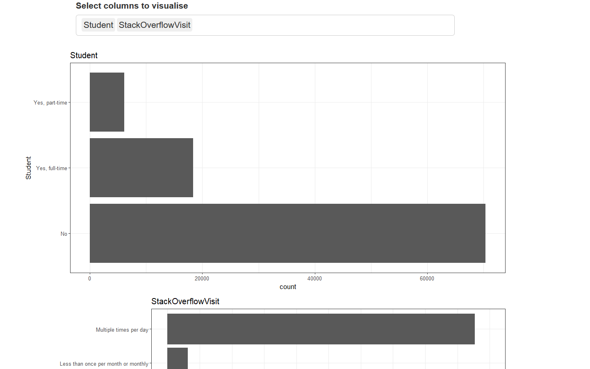

## The challenge

Recently I saw that StackOverflow released their [survey data](https://insights.stackoverflow.com/survey/) and had been posted on Kaggle. The data came with the following context "Want to dive into the results yourself and see what you can learn about salaries or machine learning or diversity in tech?" and given that June is indeed *shiny-appreciation* month, I thought this would be a fun opportunity to combine an interesting public dataset, some exploratory analysis in shiny and uhhh.. my first blog.

Talking about this with a colleague at work, we both decided to independently have a crack and then compare our approaches. You can check out his blog [here]().

## The data and idea

The data looked very rich, with almost 100k rows and 129 variables - a feast for any data addict. Feeling gluttonous, I wanted to take a bite out of every variable but without writing a tonne of code. So... iteration!

## Exploration through iteration

Typically, the apps I have written in the past have consisted of a small number of well defined outputs in a fixed layout. Whilst this is appropriate for presenting a prescribed analysis, it is a bit cumbersome and slow for exploration. For this app, I wanted a different approach which had fast exploration, dynamic layout and hopefully powered by a small amount of code.

To do this, I would need a more programmatic way of creating UI elements and their corresponding outputs. The only non-reactive ui element that I needed is a simple `selectInput` (for the user to select variables), all other UI elements and outputs would then react to this selection. To allow for reactive ui elements I needed to stick in a ui placeholder `uiOutput` which would then be defined server-side with `renderUI`

``` r
ui <- fluidPage(
  # User selection
  selectInput("cols",
              label = "Select columns to visualise",
              choices = colnames(survey_data),
              multiple = TRUE,
              width = '800px'),
  
  # UI placeholder
  uiOutput("p")
)
```

Having finished the basic structure on the UI side, I made a start on a programmatic way of creating the ui outputs (in this case, using `plotOutput`). The basic idea here is to create an output placeholder for each selection the user makes. Each of these outputs will have an associated id of the selected variables. To make it work, we require returning a list of these outputs inside the `renderUI` expression - this can be achieved by using `tagList` (shiny equivalent of a list) and assigning elements iteratively using a `for` loop.

``` r
server <- function(input, output) {
  
  # Define our UI placeholder using the user selection
  output$p <- renderUI({
    
    # Define an empty tagList
    plots <- tagList()
    
    # Iterate over input column selection
    for (col in input$cols) {
      plots[[col]] <- plotOutput(col)
    }
    
    plots
    
  })
  
}
```
At this point, we have created a list of output placeholders but haven't defined what these outputs will look like. 

Before showing the code, I want to address some of the parts that need to come together to make this work. Firstly, we need our output to **reactively** render depending on the selection made by the user. In our case, we have a reactive input called `input$cols`. Now for each element of this input, we want to render a plot so the looping needs to be outside of the render statement (unlike the ui creation that looped inside a render statement) but as we are looping over a reactive object, we require a [reactive context](https://shiny.rstudio.com/articles/reactivity-overview.html) - in this case an `observe` statement fits perfectly.

```r
server <- function(input, output) {
  
  # Define our UI placeholder using the user selection
  output$p <- renderUI({
    
    # Define an empty tagList (shiny equivalent of a list)
    plots <- tagList()
    
    # Iterate over input column selection
    for (col in input$cols) {
      plots[[col]] <- plotOutput(col)
    }
    
    plots
    
  })
  
  # Define created outputs
  observe({
    
    # Iterate over input column selection
    lapply(input$cols, function(col) {
      
      # Render output for each associated output id
      output[[col]] <- renderPlot({
        
        hist(rnorm(10), main = col)
        
      })
      
    })
    
  })
  
}
```
## Back to the StackOverflow survey

In the previous sections, I introduced how to construct ui and server creation by way of iteration. Now I want to combine it with the StackOverflow survey to show how this kind of app can be effective for quick exploratory analysis.

There are many ways that we can explore a dataset but I have gone for pure simplicity - plotting a univariate distribution for each variable (histogram for continuous, barplot for categorical). The only other notable shiny addition is the use of [validate](https://shiny.rstudio.com/articles/validation.html) to firstly have some control over which variables are plotted but also to give the user an informative message of why a plot isn't shown.



The full code can be found below:

```r

# Packages
library(shiny)
library(readr)
library(dplyr)
library(ggplot2)

# Data (change to appropriate file path)
survey_data <- read_csv("../data/survey_results_public.csv")

# Defining the UI part of the app
ui <- fluidPage(
  
  column(
    width = 6,
    offset = 3,
    fluidRow(
      selectInput("cols",
                  label = "Select columns to visualise",
                  choices = colnames(survey_data),
                  multiple = TRUE,
                  width = '800px')
    )
  ),
  
  # Main output
  column(
    width = 8,
    align = "center",
    offset = 2,
    uiOutput("p")
  )
  
)

# Defining the server part of the app
server <- function(input, output) {
  
  # Define our UI placeholder using the user selection
  output$p <- renderUI({
    
    # Define an empty tagList (shiny equivalent of a list)
    plots <- tagList()
    
    # Iterate over input column selection
    for (col in input$cols) {
      plots[[col]] <- plotOutput(col)
    }
    
    plots
    
  })
  
  # Trigger everytime the input columns are changed
  observe({
    
    lapply(input$cols, function(col) {
      
      # Remove NA entries
      d <- survey_data[!is.na(survey_data[[col]]), ]
      
      # Column class
      cc <- class(d[[col]])
      
      output[[col]] <- renderPlot({
        
        # Plots only defined for chracter, numeric & integer
        validate(need(cc %in% c("character", "numeric", "integer"),
                      paste("Plots undefined for class", cc)))
        
        if (cc == "character") {
          
          # Only show barplot if we have fewer than 20 bars
          validate(need(length(unique(d[[col]])) < 20,
                        paste(col, "contains more than 20 levels")))
          
          # Basic ggplot barplot
          ggplot(d, aes_string(x = col)) +
            geom_bar() +
            coord_flip() +
            theme_bw() +
            ggtitle(col)
          
        } else {
          
          # Basic ggplot histogram
          ggplot(d, aes_string(x = col)) +
            geom_histogram() +
            theme_bw() +
            ggtitle(col)
          
        }
        
      })
      
    })
    
  })
  
}

shinyApp(ui = ui, server = server)
```

## Conclusion

For me, Shiny's great strength is it's versatility; analysis can come in many shapes and sizes so it is only fitting that Shiny, a framework for sharing analysis, can also be written in multitude of ways. In this blog post, the app wasn't particularly snazzy (so probs not to be shared with the senior managers or as an 'inspirational' linkedin post) but it does what I want: quick exploration, dynamic layout & less than 100 lines of code!

Asides from that, I had a lot of fun exploring the survey data, especially variables relating to health-lifestyle of developers - I'm no physician but, devs, try to do at least some exercise...

Wishing you all a happy end to shiny-appreciation month, keep writing 'em apps, and see ya next time :)


